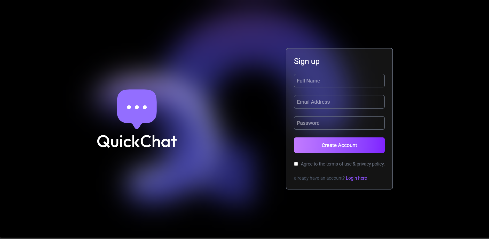

# 💬 Real-Time Chat Application

This is a full-stack real-time chat application built with the MERN stack (MongoDB, Express, React, Node.js) and Socket.IO. It supports private 1-on-1 messaging, authentication, and real-time updates like seen/unseen messages.



---

## 🚀 Features

- 🔒 User authentication (login/signup)
- 💬 Real-time 1-to-1 chat using Socket.IO
- ✅ Seen/unseen message status
- 📤 Image and text message support
- 🔔 Message notifications in sidebar
- 🌐 RESTful APIs with Express.js
- 🧠 MongoDB for storing users and messages
- 🔧 Protected routes using middleware

---

## 🛠 Tech Stack

**Frontend:**  
- React.js  
- Axios  
- Socket.IO Client  
- Context API

**Backend:**  
- Node.js  
- Express.js  
- MongoDB with Mongoose  
- Socket.IO  
- JWT for authentication  
- bcryptjs for password hashing  

---

## 📁 Folder Structure

```bash
chat-app/
├── client/
│   ├── public/
│   └── src/
│       ├── components/
│       ├── context/
│       ├── pages/
│       ├── App.js
│       └── index.js
│   └── .env
├── server/
│   ├── config/
│   ├── controllers/
│   ├── middleware/
│   ├── models/
│   ├── routes/
│   ├── index.js
│   └── .env
├── .gitignore
└── README.md

---
 ⚙️ Setup Instructions
1. Clone the repository

```bash
git clone https://github.com/yourusername/chat-app.git
cd chat-app
